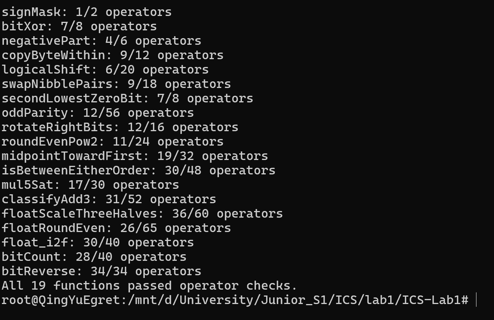
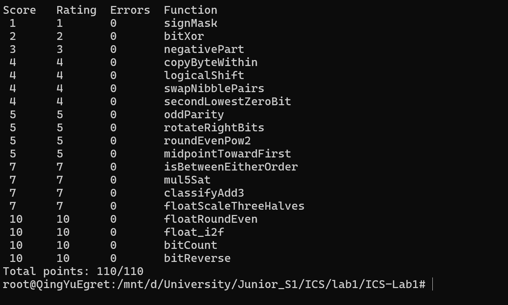

# Lab1：DataLab 实验报告

- 姓名：Tianyu Zhou
- 学号：24300120169
- 仓库：https://github.com/qingc188/ICS-Lab1

## 一、实验环境与测试

实验使用 Windows 上的 WSL 2，发行版为 Ubuntu 22.04.5 LTS，CPU 架构为 x86-64。安装 `gcc-multilib` 和 `libc6-dev-i386` 后，可以使用模板 Makefile 的 `-m32 -fwrapv` 参数构建 32 位测试程序。

代码只修改了 `bits.c` 中的 19 个函数体，没有修改函数接口、测试程序和评分 workflow。每次测试前重新构建，避免运行旧版本：

```bash
make clean
make all
./check_ops.py bits.c
./btest
```

规则检查结果为 `All 19 functions passed operator checks.`；正确性测试中全部题目的 Errors 为 0，总分为 `110/110`。一键检查 `./test.sh` 也返回 `all checks passed: 110/110`。

### 运算符规则检查



### 正确性测试



## 二、各函数实现思路

### P1 signMask

这题只需要把最低位的 1 移到最高位，所以返回 `1 << 31`。直接写 `0x80000000` 会超过允许的常量范围，左移就没有这个问题。

### P2 bitXor

不能直接用 `^`，就从异或的真值表考虑：两位相同返回 0，不同返回 1。`x & y` 找出两位都是 1 的位置，`~x & ~y` 找出两位都是 0 的位置。把这两种情况都排除，得到 `~(x & y) & ~(~x & ~y)`。

### P3 negativePart

用 `x >> 31` 判断符号。负数右移后得到全 1，和 `~x + 1` 相与就保留相反数；非负数得到全 0，相与后返回 0。`INT_MIN` 比较特殊，它的相反数不能用 int 表示，在实验规定的 32 位模型下仍是 `0x80000000`。

### P4 copyByteWithin

一个字节有 8 位，所以用 `src << 3`、`dst << 3` 得到位置。先把源字节移到最低位，与 `255` 取出这 8 位；再把目标位置清零，把源字节放进去。例如把 `0x11223344` 的第 0 个字节复制到第 2 个字节，结果就是 `0x11443344`。源字节要先取出来，不能先清目标位置。

### P5 logicalShift

直接写 `x >> n`，负数的高位会补 1，而题目要求补 0。做法是先右移，再用 `~(((1 << 31) >> n) << 1)` 清掉高位多出来的 1。`n=0` 时这个掩码为全 1，原值不变；`n=31` 时只保留最低位，也符合要求。

### P6 swapNibblePairs

用小常量拼出 `0x0f0f0f0f`，选中每个字节的低 4 位。选中的部分左移 4 位；原数据右移 4 位后，再用同一个掩码取出原来的高 4 位。最后合并两部分，例如 `0xAB` 就变为 `0xBA`。

### P7 secondLowestZeroBit

先取反，原来的 0 就成了 1。接着用 `v & (v-1)` 去掉最低的一个 1，再用 `v & (-v)` 取出剩下的最低位，这就是原数据中第二个 0 的位置。代码不能用减号，减一写成 `v + ~0`，取负写成 `~v + 1`。如果原来只有一个 0 或没有 0，结果自然为 0。

### P8 oddParity

把数据分别右移 16、8、4、2、1 位并与当前结果异或，最后所有位的奇偶性都集中在最低位。题目要的是奇校验位：原数据有偶数个 1 时返回 1，所以最后还要对最低位取逻辑非。例如 5 的二进制有两个 1，返回 1；7 有三个 1，返回 0。

### P9 rotateRightBits

循环右移分成两部分：原数据向右移，低位被移出的部分放回高位，再按位或。右移部分沿用 P5 的逻辑右移方法。因为 `n` 可能超过 31，先用 `n & 31` 取模；左移量写成 `(~shift + 1) & 31`，这样 `n=0` 或 32 的倍数时不会出现移位 32 位的问题。

### P10 roundEvenPow2

这题关键是中点不能统一向上取整。令 `half` 为半个区间，给 `x` 加上 `half-1`，再加上当前商的最低位，之后右移、左移 `n` 位。当余数恰好为一半时，偶数商不会进位，奇数商会进位。例如 10 和 14 都是中点，但按 4 的倍数舍入时分别得到 8 和 16。

### P11 midpointTowardFirst

直接算 `(x+y)/2` 会遇到加法溢出，所以用 `(x & y) + ((x ^ y) >> 1)` 先得到向下取整的中点。如果和是奇数，还要看第一个参数在哪边：`x>y` 就加一，否则保持原值。例如 `(4,7)` 返回 5，交换参数后返回 6。比较大小也要区分同号和异号，异号时不能直接用差的符号判断。

### P12 isBetweenEitherOrder

不必先把 `a`、`b` 排序，只要分别判断 `x<a`、`x<b`。两个判断不同，说明 x 在两端点之间；再补上 x 等于任一端点的情况，得到闭区间判断。比较时，同号看差的符号，异号看原来的符号位，避免差值溢出带来的误判。

### P13 mul5Sat

用加法依次得到 `2x`、`4x`、`5x`，同时检查各步符号有没有变化。不能只看最终的 `5x`，因为发生溢出后，结果也可能绕回原来的符号。有任何一步溢出，就按 x 的符号返回 `INT_MAX` 或 `INT_MIN`；否则保留计算结果。选择结果用掩码完成，不需要 if。

### P14 classifyAdd3

这题不能把“某一步溢出”当成“最后的和溢出”。例如 `INT_MAX + 1 + (-1)`，最终仍然是 `INT_MAX`。

实现中保留两次加法的低 32 位，另外计算每次的无符号进位。三个数右移 31 位得到的符号扩展值，加上这两个进位，可以表示总和的高位。高位与最终低 32 位的符号扩展一致时返回 0；不一致时，根据差值的正负返回 1 或 -1。整个过程只用了 int，没有借助更宽的类型。

### P15 floatScaleThreeHalves

先拆出符号、阶码和尾数，NaN 和无穷直接返回。普通规格化数需要补上隐藏的 1，非规格化数则不补，并按有效阶码 1 参与计算。把整数形式的有效数乘 3，再通过移位和调整阶码完成除以 2。

移位时不能直接丢掉低位，还要按最近偶数规则舍入：超过一半就进位，恰好一半时看保留部分的最低位。舍入后可能多出一位，要再调整阶码；非规格化数达到规格化范围时也要更新阶码。阶码超出范围则返回无穷。正零、负零保留各自的符号。

### P16 floatRoundEven

按阶码把数据分成几类。绝对值不超过 0.5 时舍入为零，并保留符号；绝对值大于 0.5、小于 1 时得到带原符号的 1。其他情况先清除小数位，再根据被清除部分决定是否进位。中点取偶数，所以 2.5 得到 2.0，3.5 得到 4.0。

阶码达到 150 后，单精度数本来就是整数值，直接返回即可；NaN 和无穷也原样返回。这里返回的仍是浮点位编码，不能直接返回整数 2 或 4。

### P17 float_i2f

零单独返回。非零输入先记录符号，用 unsigned 保存绝对值，这样 `INT_MIN` 也能处理。右移找到最高的 1 后，就能确定阶码和有效数的位置。

单精度只有 24 位有效精度（包括隐藏的 1）。位数够用就直接对齐，超过 24 位就检查丢弃部分并舍入。如果舍入后有效数多出一位，阶码也要加一。例如 `16777217` 已无法被单精度精确表示，按最近偶数舍入得到 `16777216`。

### P18 bitCount

整数题不能写循环，所以把 32 位分组计算。先求每 2 位中有几个 1，再合并成每 4 位、每 8 位的计数，最后把各组加起来。`0x55555555`、`0x33333333`、`0x0f0f0f0f` 分别用来分隔这些组，掩码都由小常量拼出。结果最大是 32，最后保留低 6 位即可。

### P19 bitReverse

先交换相邻位，再交换相邻的 2 位组、4 位组、字节，最后交换两个 16 位半字，就完成了整段反转。

这题的操作数限制较紧，不能把所有掩码分别拼一遍。实现中先构造 `0x00ff00ff`，再通过异或左移结果，依次得到 `0x0f0f0f0f`、`0x33333333`、`0x55555555`。右移后都加了掩码，防止符号位补入的 1 干扰结果。规则检查恰好是 34/34，不能再随意增加运算。

## 三、实验感受

我之前学过位运算，但实际用得不多。这次实验中，我对中点取偶数、溢出判断和分组位操作印象比较深。比如 2.5 和 3.5 的舍入结果不同，三数求和也不能只看中间有没有溢出。统计 1 和反转位可以分组处理，不一定要逐位循环，这种做法值得再仔细理解。运行测试时，各题的操作数、Errors 和分数都很直观，也让我更清楚地认识到：结果正确还不够，写法也要符合题目的限制。以后做类似题，我会多检查 `INT_MIN`、移位边界和浮点特殊值，不能只看几个普通例子是否通过。

## 四、参考资料

- [课程 Lab1 文档](https://ics-26fall-fdu.github.io/labs/lab1-data-lab/)及 [DataLab 模板 README](https://github.com/ICS-26Fall-FDU/DataLab)。
- 模板 `bits.c` 的逐题约束与机器模型、`tests.c` 的参考行为定义。
